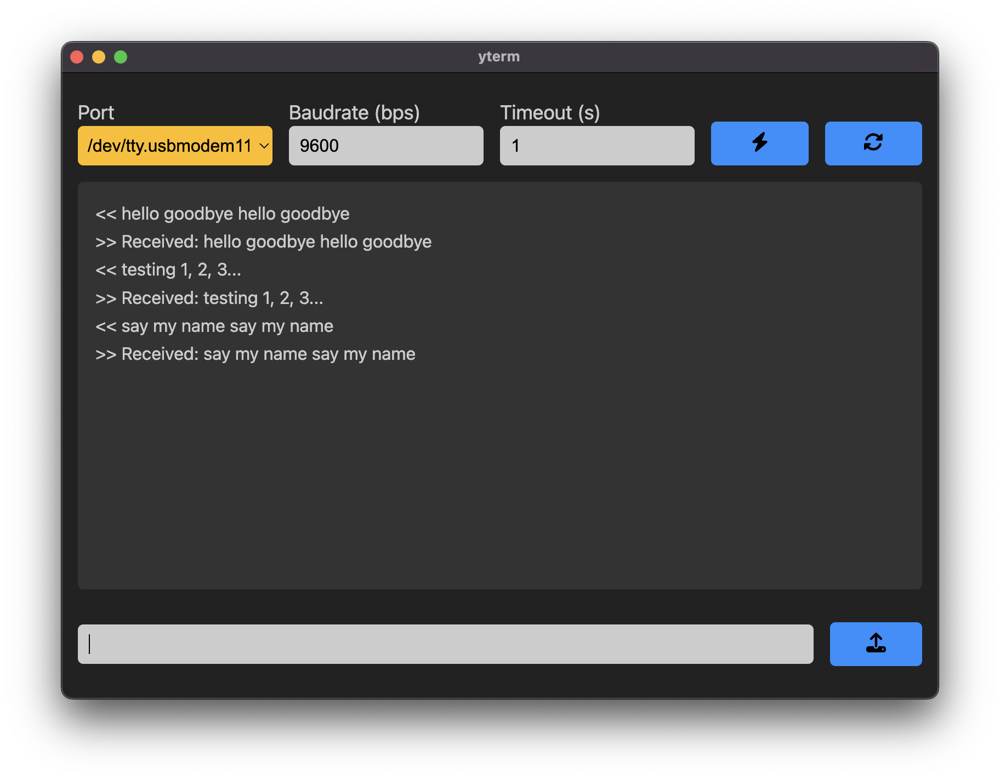

# yterm

A basic serial terminal for hardware debugging. Application automatically finds available comports and pushes notifications for the connection status.



## Installation

Requires the Node package manager (`npm`). To add `npm` to your development environment, follow the instructions at [lukasvasaid.github.io](https://lukasvasadi.github.io/posts/environment.html).

Clone this repository:

```zsh
git clone git@github.com:lukasvasadi/yterm.git
```

Navigate inside project directory and install dependencies:

```zsh
npm i
```

Start application:

```zsh
npm start
```
